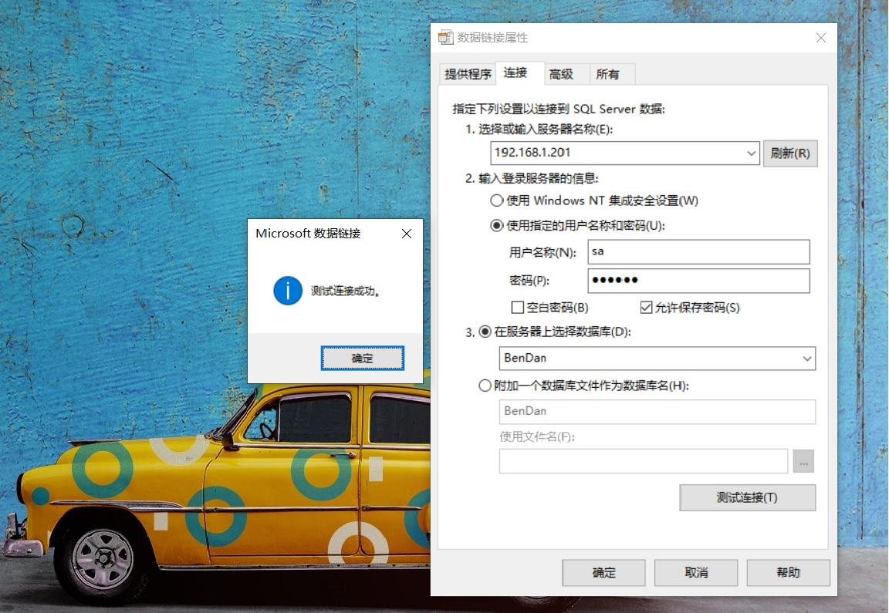

如何快速获取数据库连接字符串？并且阔以验证数据库是否能连接成功？拾壹分享一个教程，只需三步就能获取数据库连接字符串。


## 需求
>完成以下操作需要准备的工具
1. Windows操作系统（xp-10理论上都阔以）💻
2. Sql Server数据库环境 🛢

<!--More-->

## 第一步
新建一个 `DbContext.txt`文本文件。将文本文件的后缀名`txt`改成`dul`(如果系统默认没有显示文件后缀名可以进行以下操作。打开`我的电脑`，点击左上角`查看`，勾选`文件扩展名`选项)。

## 第二步
双击`DbContext.dul`打开文件。如下图01所示：

<center>[图01]</center>
如上图所示依次输入,`服务器IP`,`登录名`,`密码`远程数据库登录信息。这里注意一个细节。勾选`允许保存密码`。不勾选的话生成的字符串连接字符串里是不带用户登录密码的。
点击`连接测试`，提示`测试连接成功`。点击`完成`即完成数据连接。

## 第三步

选中 `DbContext.dul`文件 ，鼠标右击`打开方式`，查看`更多应用`,选择`记事本`打开。记事本打开后可以看到如下字符串

``` csharp
[oledb]
; Everything after this line is an OLE DB initstring
Provider=SQLOLEDB.1;Password=123456;Persist Security Info=True;User ID=sa;
Initial Catalog=BenDan;Data Source=192.168.1.201
```

其中

``` csharp
Provider=SQLOLEDB.1;Password=123456;Persist Security Info=True;User ID=sa;
Initial Catalog=BenDan;Data Source=192.168.1.201
```
即为当前 SQL Server 数据库连接字符串